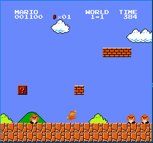
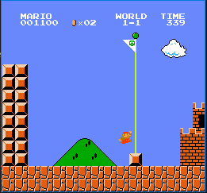

# Super_mAIrio
Super_mAIrio is a project developed by a group of students for the course of AI Lab of the Bachelor's Degree in Computer Science at the University of La Sapienza.\
The project is developed by: 

- [Daniele Venturini](https://github.com/Dalphan)
- [Diana Pamfile](https://github.com/LadiDBug)
- [Simone Rufo](https://github.com/simonerufo)
- [Leila Zanoni](https://github.com/LleilaA13)

The objective of the project is to create an AI agent that can play the Super Mario Bros game, exploiting a reinforcement learning approach based on Double Deep Q-Network (DDQN).

## Description
The project is based on the [gym-super-mario-bros](https://github.com/Kautenja/gym-super-mario-bros) environment, which is a custom environment for OpenAI Gym that allows the user to play the Super Mario Bros game.

<p align="center">
    <br>
    <em>Figure 1: Mario plays</em><br>
    <br>
    <em>Figure 2: Mario completes the level</em><br>
</p>

## Installation
To install the project, you need to clone the repository and install the required packages.\
To clone the repository, run the following command:
```bash
git clone https://github.com/ForzaElettromotrice/Super_mAIrio.git
```
Then, you need to install the required packages. To do so, run the following command:
```bash
pip install -r requirements.txt
```

## Usage
To run the project, you need to run the following command:
```bash
python main.py
```
